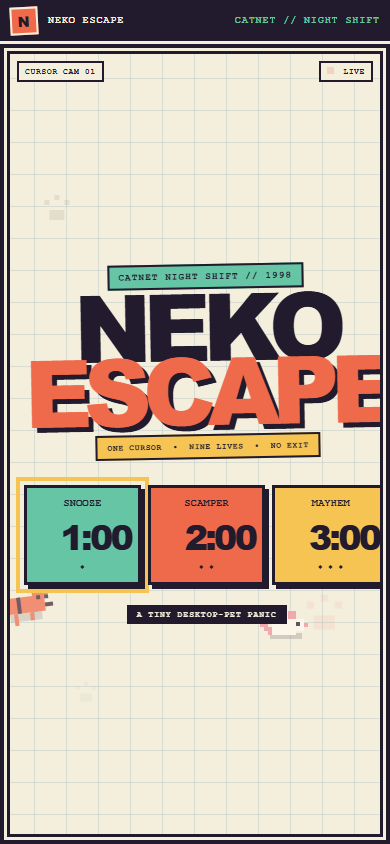
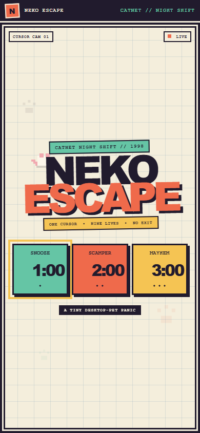

# Process overview

## What I built

**Neko Escape** turns the WebNeko desktop-pet feeling into one survival rule:
an original pixel cat follows the pointer-mouse, contact loses, and zero on the
clock wins. The one-, two- and three-minute nights add cats at increasing
pressure; slow, steady and fast coats behave differently. An animated menu
demonstrates the relationship without a tutorial.

## The moments that mattered

### I rebuilt the harness before the game

The inherited harness still described Vite/TypeScript and carried Crit 2/4
history. I preserved the bare stack, made `CLAUDE.md` the stable rule owner,
added a thin `AGENTS.md`, and put this week's response in `PLAN.md`. It records
the WSL command path, `mise exec`, instead of the machine's older Node. See
[`209cc6e`](https://github.com/comp4020-agentic-coding-studio/comp4020-crit5-Naaeeen/commit/209cc6e).

> “look at the existing harness ... remove Crit 4-specific requirements ...
> update CLAUDE.md ... plan before action.”

### I gave tests and play different jobs

The first rule run failed because `game-rules.js` did not exist. The green slice
injected random rolls and tested durations, collision precedence, clamping,
safe edge spawns and distinct cat speeds. That made the simulation
deterministic without pretending tests could prove fairness or no-tutorial
play. See
[`3e31d19`](https://github.com/comp4020-agentic-coding-studio/comp4020-crit5-Naaeeen/commit/3e31d19).

### The finished game corrected the phone layout

Playwright cold-played the built output at `1920×1080` and `390×844`: desktop
lost and replayed, phone touch started hard mode, and a 23-second run produced a
second coloured cat with a clean console. The first phone screenshot exposed
what 33 green checks missed: “ESCAPE” and `3:00` touched the clipped frame. I
reduced only the mobile type and spacing, then replayed and captured the
correction. See
[`b18f309`](https://github.com/comp4020-agentic-coding-studio/comp4020-crit5-Naaeeen/commit/b18f309).

| Before play correction | After play correction |
| --- | --- |
|  |  |
